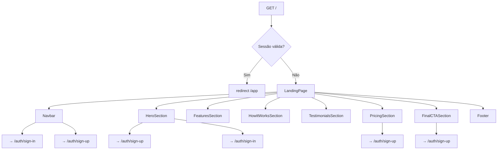

# Design Document — Landing Page Complete

## Overview

Expansão do componente `src/components/landing-page.tsx` de uma tela de auth simples para uma landing page completa do LabelStudio Elite. A página passa a ter 8 seções: Navbar, Hero, Features, How It Works, Testimonials, Pricing, Final CTA e Footer — todas mantendo consistência total com o design system existente (glassmorphism, tokens oklch, framer-motion).

A arquitetura mantém o Server Component em `src/app/page.tsx` verificando sessão no servidor e renderizando `LandingPage` para visitantes não autenticados. Os sub-componentes de cada seção ficam em `src/components/landing/` para organização, e são compostos dentro de `LandingPage`.

## Architecture



**Decisões de design:**

- Sub-componentes em `src/components/landing/` para manter `landing-page.tsx` legível
- `AuthGradientBackground` reutilizado no Hero e FinalCTA com `idPrefix` distintos para evitar conflito de IDs SVG
- Scroll animations via `useInView` do framer-motion (padrão já usado em `sign-in.tsx`)
- Navbar com `useScrollY` local (estado simples com `window.scrollY`) para efeito de opacidade progressiva
- Conteúdo estático hardcoded nos componentes — sem CMS, sem API calls
- `scroll-behavior: smooth` aplicado via `html { scroll-behavior: smooth }` no CSS global ou inline no componente

## Components and Interfaces

### Estrutura de arquivos

```
src/components/
  landing-page.tsx          ← componente raiz (Client Component)
  landing/
    navbar.tsx              ← barra de navegação fixa
    hero-section.tsx        ← hero com AuthGradientBackground
    features-section.tsx    ← grid de 6 cards de funcionalidades
    how-it-works-section.tsx ← 4 etapas numeradas
    testimonials-section.tsx ← 3+ depoimentos
    pricing-section.tsx     ← 3 planos (Gratuito, Pro, Enterprise)
    final-cta-section.tsx   ← CTA final com gradiente
    footer.tsx              ← rodapé com links e copyright
```

### `LandingPage` (landing-page.tsx)

Componente raiz que compõe todas as seções. Injeta `sharedStyles` (glass-button CSS) e define o `SidebarLogoHex` compartilhado.

```typescript
export function LandingPage() {
  return (
    <div className="bg-background min-h-screen w-screen overflow-x-hidden">
      <style>{sharedStyles}</style>
      <Navbar />
      <main>
        <HeroSection />
        <FeaturesSection />
        <HowItWorksSection />
        <TestimonialsSection />
        <PricingSection />
        <FinalCTASection />
      </main>
      <Footer />
    </div>
  );
}
```

### `Navbar` (landing/navbar.tsx)

Barra de navegação fixa com efeito glassmorphism progressivo ao scroll.

```typescript
interface NavbarProps {} // sem props — conteúdo estático

// Estado interno:
const [scrolled, setScrolled] = useState(false);
// useEffect: window.addEventListener('scroll', ...) → setScrolled(window.scrollY > 80)
```

Elementos: logo + nome à esquerda, links âncora no centro (Features, Como funciona, Preços), botões "Entrar" e "Criar conta" à direita. Em mobile: menu hamburger com drawer ou links colapsados.

### `HeroSection` (landing/hero-section.tsx)

```typescript
interface HeroSectionProps {} // sem props

// Elementos:
// - AuthGradientBackground idPrefix="hero"
// - Logo SVG + heading font-serif
// - Subtítulo
// - Botões CTA (Criar conta + Entrar)
// - ProductPreview: painel auth-frost-panel com mockup estilizado
```

### `FeaturesSection` (landing/features-section.tsx)

```typescript
interface Feature {
  icon: React.ReactNode;
  title: string;
  description: string;
}

const FEATURES: Feature[] = [
  // 6 itens: criação de rótulos, gestão de projetos, importação de dados,
  // preview em tempo real, conformidade regulatória, exportação profissional
];
```

Grid responsivo com `useInView` por card para animação escalonada.

### `HowItWorksSection` (landing/how-it-works-section.tsx)

```typescript
interface Step {
  number: number; // 1–4
  title: string;
  description: string;
  icon: React.ReactNode;
}

const STEPS: Step[] = [
  /* 4 etapas */
];
```

Layout horizontal em desktop (com linha conectora), vertical em mobile.

### `TestimonialsSection` (landing/testimonials-section.tsx)

```typescript
interface Testimonial {
  quote: string;
  name: string;
  role: string; // cargo/empresa
  initials: string; // para avatar placeholder
}

const TESTIMONIALS: Testimonial[] = [
  /* mínimo 3 */
];
```

### `PricingSection` (landing/pricing-section.tsx)

```typescript
interface PricingPlan {
  name: string;
  price: string;       // ex: "Grátis", "R$ 49/mês"
  features: string[];
  highlighted: boolean; // true = Pro
  ctaLabel: string;
}

const PLANS: PricingPlan[] = [
  { name: "Gratuito", highlighted: false, ... },
  { name: "Pro",      highlighted: true,  ... },
  { name: "Enterprise", highlighted: false, ... },
];
```

Card Pro usa `auth-frost-panel-strong` + badge "Recomendado". Demais usam `auth-frost-panel`.

### `FinalCTASection` (landing/final-cta-section.tsx)

Seção com `AuthGradientBackground idPrefix="cta"`, headline serif, subtítulo e botão `auth-cta-glow`.

### `Footer` (landing/footer.tsx)

```typescript
interface FooterLinkGroup {
  title: string;
  links: { label: string; href: string }[];
}

const LINK_GROUPS: FooterLinkGroup[] = [
  {
    title: "Produto",
    links: [
      { label: "Funcionalidades", href: "#features" },
      { label: "Preços", href: "#pricing" },
    ],
  },
  {
    title: "Empresa",
    links: [
      { label: "Sobre", href: "#" },
      { label: "Contato", href: "#" },
    ],
  },
  {
    title: "Legal",
    links: [
      { label: "Termos", href: "#" },
      { label: "Privacidade", href: "#" },
    ],
  },
];
```

### Componente utilitário: `SectionWrapper`

Wrapper reutilizável para padding e `id` de âncora:

```typescript
interface SectionWrapperProps {
  id?: string;
  className?: string;
  children: React.ReactNode;
}
```

### Componente utilitário: `ScrollReveal`

Wrapper de animação de entrada ao scroll, baseado no padrão `BlurFade` de `sign-in.tsx`:

```typescript
interface ScrollRevealProps {
  children: React.ReactNode;
  delay?: number; // delay em segundos
  className?: string;
}
// Internamente usa useInView + motion.div com variants hidden/visible
```

## Data Models

Não há modelos de dados externos. Todo o conteúdo é estático, definido como constantes nos componentes.

**Tipos de conteúdo estático:**

```typescript
// Feature card
type Feature = { icon: React.ReactNode; title: string; description: string };

// How it works step
type Step = {
  number: number;
  title: string;
  description: string;
  icon: React.ReactNode;
};

// Testimonial
type Testimonial = {
  quote: string;
  name: string;
  role: string;
  initials: string;
};

// Pricing plan
type PricingPlan = {
  name: string;
  price: string;
  period?: string; // "por mês" | undefined para Gratuito
  features: string[];
  highlighted: boolean;
  ctaLabel: string;
};

// Footer link group
type FooterLinkGroup = {
  title: string;
  links: { label: string; href: string }[];
};
```

**Estado local (apenas Navbar):**

```typescript
// Navbar
const [scrolled, setScrolled] = useState(false);
// true quando window.scrollY > 80
```

## Error Handling

| Cenário                                                 | Comportamento                                                                   |
| ------------------------------------------------------- | ------------------------------------------------------------------------------- |
| `window` não disponível no SSR (Navbar scroll listener) | `useEffect` garante que o listener só é registrado no cliente                   |
| `AuthGradientBackground` com IDs duplicados             | Cada instância recebe `idPrefix` único (`"hero"`, `"cta"`)                      |
| Links âncora sem seção correspondente                   | Scroll suave para o topo da página (comportamento padrão do browser)            |
| Imagens/assets de mockup ausentes                       | ProductPreview usa elementos SVG/CSS puros, sem dependência de assets externos  |
| Modo escuro não detectado                               | Tailwind `dark:` classes respondem automaticamente à classe `.dark` no `<html>` |

## Testing Strategy

Esta feature é inteiramente de UI estática com navegação. A análise de prework confirmou que **property-based testing não se aplica** — todos os critérios de aceitação são verificações de renderização, presença de elementos, classes CSS e interações específicas. Não há funções puras com espaço de input amplo que se beneficiem de PBT.

### Por que PBT não se aplica

- Todos os critérios testam renderização de UI (presença de elementos, classes, textos)
- Não há transformações de dados ou lógica de negócio com variação de input
- O único estado dinâmico é `scrolled: boolean` na Navbar — binário, não um espaço de input amplo
- Navegação é sempre para rotas fixas (`/auth/sign-in`, `/auth/sign-up`)

### Testes unitários (example-based)

**Navbar:**

```typescript
it("renderiza links âncora para Features, Como funciona e Preços");
it("renderiza botões Entrar e Criar conta");
it("aplica classe de opacidade quando scrolled=true");
it("clique em Entrar navega para /auth/sign-in");
it("clique em Criar conta navega para /auth/sign-up");
```

**HeroSection:**

```typescript
it("renderiza logo SVG hexagonal");
it('renderiza heading "LabelStudio Elite" em font-serif');
it("renderiza subtítulo descritivo");
it('renderiza botão "Criar conta" com classe auth-cta-glow');
it('renderiza botão "Entrar" com glass-button');
it('clique em "Criar conta" navega para /auth/sign-up');
it('clique em "Entrar" navega para /auth/sign-in');
it("renderiza elemento de preview dentro de auth-frost-panel");
```

**FeaturesSection:**

```typescript
it("renderiza exatamente 6 cards de funcionalidades");
it("cada card tem ícone, título e descrição");
it("container tem classes grid-cols-1 md:grid-cols-2 lg:grid-cols-3");
it("cada card tem classe auth-frost-panel ou liquid-glass");
it("renderiza título de seção e subtítulo");
it("conteúdo inclui as 6 funcionalidades especificadas");
```

**HowItWorksSection:**

```typescript
it("renderiza exatamente 4 etapas");
it("cada etapa tem número, título, descrição e ícone");
it("renderiza elemento conector entre etapas");
it("renderiza título de seção em font-serif");
```

**TestimonialsSection:**

```typescript
it("renderiza pelo menos 3 cards de depoimento");
it("cada card tem quote, nome, cargo e avatar placeholder");
it("cards têm classe auth-frost-panel ou liquid-glass");
it("container tem classes grid-cols-1 lg:grid-cols-3");
```

**PricingSection:**

```typescript
it("renderiza exatamente 3 planos: Gratuito, Pro, Enterprise");
it("cada plano tem nome, preço, lista de features e botão CTA");
it("card Pro tem classe auth-frost-panel-strong");
it('card Pro tem badge ou indicador "Recomendado"');
it("cards Gratuito e Enterprise têm classe auth-frost-panel");
it("clique em CTA de qualquer plano navega para /auth/sign-up");
it("renderiza título e subtítulo da seção");
```

**FinalCTASection:**

```typescript
it("renderiza headline em font-serif");
it("renderiza subtítulo");
it('renderiza botão "Começar agora" com classe auth-cta-glow');
it('clique em "Começar agora" navega para /auth/sign-up');
```

**Footer:**

```typescript
it("renderiza logo e nome do produto");
it("renderiza 3 grupos de links: Produto, Empresa, Legal");
it("cada grupo tem seus links esperados");
it("renderiza copyright com ano atual");
it("tem classe liquid-glass ou auth-frost-panel");
it("container tem classes de grid responsivo");
```

### Testes de smoke

- Acessar `/` sem sessão retorna HTTP 200 com conteúdo da landing page
- Acessar `/` com sessão válida retorna redirect HTTP 307/308
- Verificar ausência de cores hardcoded (code review / lint)
- Verificar que não há CSS animations customizadas além das do design system

### Testes visuais (recomendados)

- Snapshot do componente completo em viewport 375px (mobile) e 1280px (desktop)
- Snapshot com classe `.dark` aplicada para verificar modo escuro
- Verificar que `AuthGradientBackground` renderiza SVG sem erros de ID duplicado
