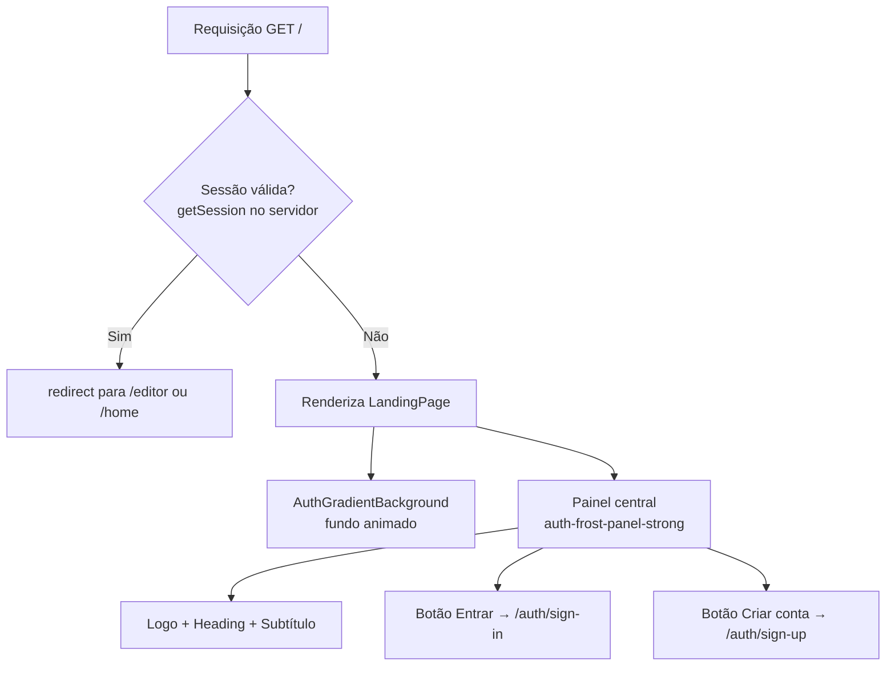

# Design Document — Landing Page

## Overview

A landing page pública substitui a rota `/` para visitantes não autenticados do LabelStudio Elite. Ela apresenta o produto com identidade visual consistente (glassmorphism, liquid glass, framer-motion) e oferece acesso direto às rotas de autenticação. Usuários autenticados são redirecionados automaticamente para o editor.

A implementação é um único Server Component (`src/app/page.tsx`) que verifica a sessão no servidor e decide entre renderizar a landing page ou redirecionar para o editor — eliminando flash de conteúdo e round-trips desnecessários no cliente.

## Architecture



**Decisão de design:** usar verificação de sessão no servidor (via `src/lib/auth/server.ts`) em vez de `useAuthenticate` no cliente. Isso evita o flash de conteúdo (Requirement 4.2) e é mais seguro. O componente `page.tsx` passa a ser um Server Component assíncrono.

> Nota: a rota atual `/` é o editor completo (`LabelStudio`). Após esta feature, o editor será movido para uma rota protegida (ex.: `/app`) e a landing page ocupará `/`.

## Components and Interfaces

### `src/app/page.tsx` (Server Component — novo)

```typescript
// Verifica sessão no servidor e redireciona ou renderiza a landing page
export default async function Page() {
  const session = await getServerSession(); // src/lib/auth/server.ts
  if (session?.user) redirect('/app');      // ou rota do editor
  return <LandingPage />;
}
```

### `src/components/landing-page.tsx` (Client Component)

Componente principal da landing page. Responsável por:

- Renderizar o layout visual completo
- Aplicar animações de entrada com `BlurFade` / `motion.div`
- Navegar para `/auth/sign-in` e `/auth/sign-up` via `useRouter`

```typescript
interface LandingPageProps {
  // sem props — conteúdo é estático
}
```

**Elementos internos:**

- `AuthGradientBackground` — fundo animado (reutilizado das telas de auth)
- `SidebarLogoHex` — logo SVG hexagonal (extraído de `page.tsx` atual)
- Painel central com classe `auth-frost-panel-strong`
- `GlassButton` (inline, mesmo padrão de `sign-in.tsx`) para "Entrar"
- Botão CTA primário com `auth-cta-glow` + gradiente para "Criar conta"

### Reutilização de componentes existentes

| Componente               | Origem                                           | Uso na landing      |
| ------------------------ | ------------------------------------------------ | ------------------- |
| `AuthGradientBackground` | `src/components/ui/auth-gradient-background.tsx` | Fundo animado       |
| `SidebarLogoHex`         | `src/app/page.tsx` (extrair)                     | Logo no topo        |
| `GlassButton` (inline)   | `src/components/ui/sign-in.tsx`                  | Botão "Entrar"      |
| `sharedStyles` (inline)  | `src/components/ui/sign-in.tsx`                  | CSS do glass-button |

> `GlassButton` e `sharedStyles` estão definidos inline em `sign-in.tsx` e `sign-up.tsx`. Para a landing page, o mesmo padrão inline será replicado no componente, mantendo consistência sem criar dependência circular.

## Data Models

Não há modelos de dados próprios. A landing page é estática — sem estado persistido, sem chamadas de API no cliente.

**Estado local do componente (`LandingPage`):**

```typescript
// Nenhum estado necessário — navegação via useRouter, sem formulários
```

**Verificação de sessão (servidor):**

```typescript
// src/lib/auth/server.ts — já existente
import { auth } from "@/lib/auth/server";
const session = await auth.api.getSession({ headers: await headers() });
```

## Error Handling

| Cenário                                                 | Comportamento                                                                                                |
| ------------------------------------------------------- | ------------------------------------------------------------------------------------------------------------ |
| `getSession` lança exceção no servidor                  | Tratar com try/catch; renderizar landing page (fail-open — melhor mostrar a landing do que uma tela de erro) |
| Sessão retorna `null` / `undefined`                     | Renderizar landing page normalmente                                                                          |
| Sessão válida                                           | `redirect()` do Next.js — não renderiza nada                                                                 |
| Navegação para `/auth/sign-in` ou `/auth/sign-up` falha | Responsabilidade das rotas de destino; a landing page apenas navega                                          |

## Testing Strategy

Esta feature é predominantemente de UI/renderização com lógica de redirecionamento condicional. A análise de prework confirmou que **property-based testing não se aplica** — não há funções puras com espaço de input amplo que se beneficiem de PBT. Os testes adequados são example-based.

### Testes unitários (example-based)

**Renderização — `LandingPage` component:**

```typescript
// Verificar presença dos elementos principais
it('renderiza heading com nome do produto', () => {
  render(<LandingPage />);
  expect(screen.getByRole('heading')).toHaveTextContent('LabelStudio Elite');
});

it('renderiza botão Entrar com link para /auth/sign-in', () => {
  render(<LandingPage />);
  expect(screen.getByText('Entrar')).toBeInTheDocument();
});

it('renderiza botão Criar conta com link para /auth/sign-up', () => {
  render(<LandingPage />);
  expect(screen.getByText('Criar conta')).toBeInTheDocument();
});
```

**Navegação:**

```typescript
it('clique em Entrar navega para /auth/sign-in', async () => {
  const pushMock = jest.fn();
  jest.mocked(useRouter).mockReturnValue({ push: pushMock } as any);
  render(<LandingPage />);
  await userEvent.click(screen.getByText('Entrar'));
  expect(pushMock).toHaveBeenCalledWith('/auth/sign-in');
});

it('clique em Criar conta navega para /auth/sign-up', async () => {
  const pushMock = jest.fn();
  jest.mocked(useRouter).mockReturnValue({ push: pushMock } as any);
  render(<LandingPage />);
  await userEvent.click(screen.getByText('Criar conta'));
  expect(pushMock).toHaveBeenCalledWith('/auth/sign-up');
});
```

**Redirecionamento (Server Component):**

```typescript
it("redireciona usuário autenticado para /app", async () => {
  mockGetSession.mockResolvedValue({ user: { id: "1" } });
  await Page();
  expect(redirect).toHaveBeenCalledWith("/app");
});

it("renderiza landing page para visitante não autenticado", async () => {
  mockGetSession.mockResolvedValue(null);
  const result = await Page();
  expect(result).not.toBeNull(); // renderiza o componente
});
```

**Estado de loading:**

```typescript
it("não exibe conteúdo da landing durante verificação de sessão", () => {
  // Coberto pela arquitetura server-side: não há estado de loading
  // visível pois o redirect acontece antes da renderização
});
```

### Testes de smoke

- Acessar `/` sem cookie de sessão retorna HTTP 200
- Acessar `/` com cookie de sessão válido retorna redirect (HTTP 307/308)
- Verificar ausência de cores hardcoded no componente (lint/code review)

### Testes visuais (recomendados)

- Snapshot do componente renderizado em viewport mobile (375px) e desktop (1280px)
- Verificar que classes responsivas (`sm:`, `md:`, `lg:`) estão presentes
- Verificar modo escuro via Tailwind dark mode
